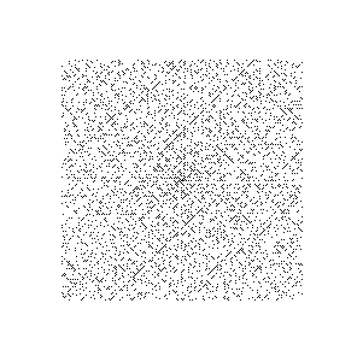
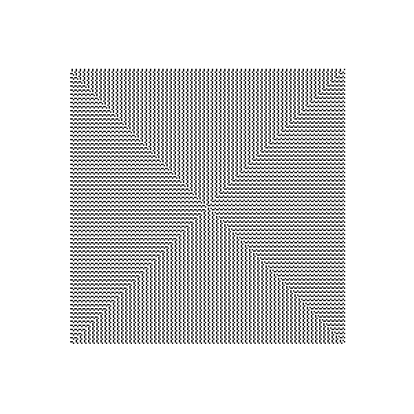
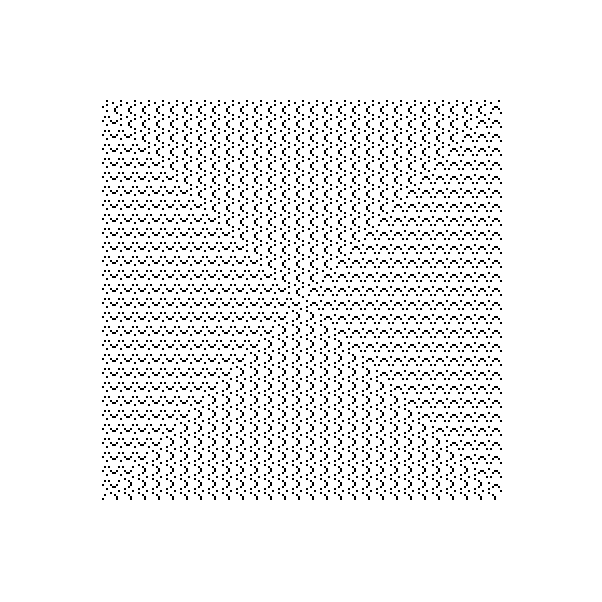
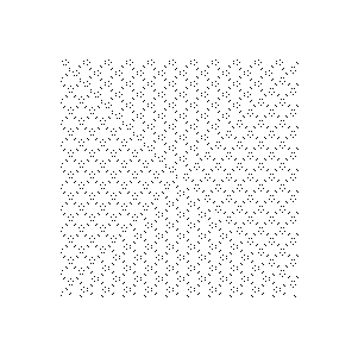
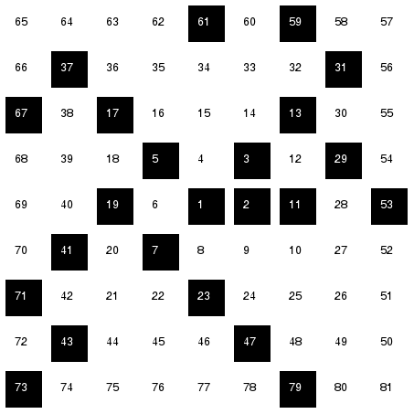

# spiral-patterns
View patterns created when prime numbers or multiples of a number are marked out in a spiral. The prime spiral is known as Ulam's spiral.

**Prime spiral**

**Multiples of 3 spiral**

**Multiples of 7 spiral**

**Multiples of 18 spiral**

**Spirals are drawn like this**

